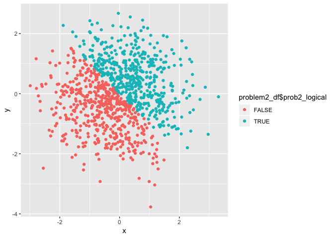
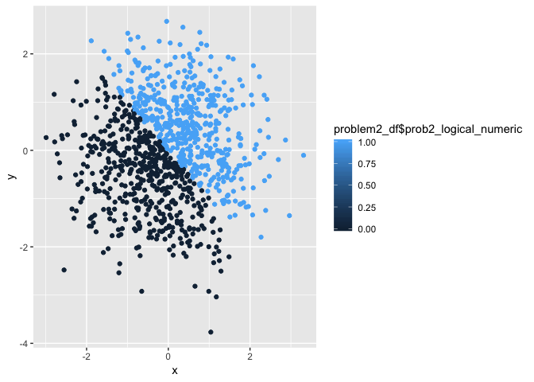
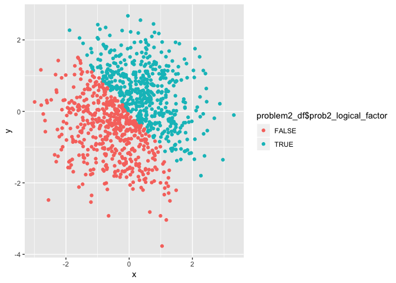

p8105\_hw1\_edm2152
================
Eric Morris
September 15, 2018

Problem 1
=========

The code chunk below creates a data frame comprised of:

-   A random sample of size 10 from a uniform\[0, 5\] distribution
-   A logical vector indicating whether elements of the sample are greater than 2
-   A (length-10) character vector
-   A (length-10) factor vector

``` r
problem1_df = tibble(
  prob1_random_sample = runif(10,0,5),
  prob1_logical = prob1_random_sample > 2,
  prob1_character = c("boy", "girl", "boy","boy", "girl","boy", "girl","boy", "girl","boy"),
  prob1_factor = factor(prob1_character)
)
```

Below I try to take the mean of each of the four variables:

The mean of the random sample variable is 2.0774319.

The mean of the logical vector variable is 0.6.

The mean of the character vector variable is NA (this will not work).

The mean of the factor vector variable is NA (this will not work).

When trying to take the mean of the four variables, only the mean of the random sample variable and the logical variable will work. We are able to take the mean of the random sample because it is numeric. The logical variable will also work, because it contains TRUE and FALSE which are reserved words in R and a boolean data type. TRUE is automatically assigned 1 by R and FALSE is assigned 0, so it will take the mean of a collection of 1s and 0s depending on the logical outcome. The vector and factor variables will not work because they contain characters.

Code chunk below will apply the as.numeric function to the logical, character, and factor variables:

``` r
  prob1_logical_numeric = as.numeric(problem1_df$prob1_logical) 
  prob1_character_numeric = as.numeric(problem1_df$prob1_character)
```

    ## Warning: NAs introduced by coercion

``` r
  prob1_factor_numeric = as.numeric(problem1_df$prob1_factor)
```

The as.numeric function works for the factor and logical variables but not for the character variable.

Below is a second code chunk that converts character variable from character to factor to numeric and converts the factor variable from factor to character to numeric.

``` r
    prob1_char_factor_numeric = as.numeric(as.factor(problem1_df$prob1_character))
    prob1_factor_char_numeric = as.numeric(as.character(problem1_df$prob1_factor))
```

    ## Warning: NAs introduced by coercion

This time, the character variable is successfully converted to numeric after first being converted to factor. The factor variable fails to convert to numeric after being converted to character, the same as the chunk before.

Problem 2
=========

Code chunk below will create a data frame comprised of:

-   x: a random sample of size 1000 from a standard Normal distribution
-   y: a random sample of size 1000 from a standard Normal distribution
-   A logical vector indicating whether the x + y &gt; 0
-   A numeric vector created by coercing the above logical vector
-   A factor vector created by coercing the above logical vector

``` r
problem2_df = tibble(
  x = rnorm(1000),
  y = rnorm(1000),
  prob2_logical = x + y > 0,
  prob2_logical_numeric = as.numeric(prob2_logical),
  prob2_logical_factor = factor(prob2_logical)
)
```

The problem 2 dataset contains 1000 rows (observations) and 5 columns (variables). The mean of x is 0.0259675 and the median of x is 0.0407023. The proportion of cases for which the logical vector is TRUE is

First scatterplot of y vs x (color is logical variable):

``` r
ggplot(problem2_df, aes(x = x, y = y, color = problem2_df$prob2_logical)) + geom_point()
```



Second scatterplot of y vs x (color is numeric variable):

``` r
ggplot(problem2_df, aes(x = x, y = y, color = problem2_df$prob2_logical_numeric)) + geom_point()
```



Third scatterplot of y vs x (color is factor variable):

``` r
ggplot(problem2_df, aes(x = x, y = y, color = problem2_df$prob2_logical_factor)) + geom_point()
```



Since the second plot involves a numeric variable, r assigns a color scale between 0 and 1 despite the fact that there are no values between 0 and 1. This differs from the logical and factor variable plots where r recognizes TRUE and FALSE as 1 and 0, respectively, but creates a binary color scheme and no scale between 0 and 1.

Exporting the first scatterplot to my project directory using ggsave:

``` r
ggsave("./prob2_first_scatter_plot.pdf", height = 4, width = 6)
```
